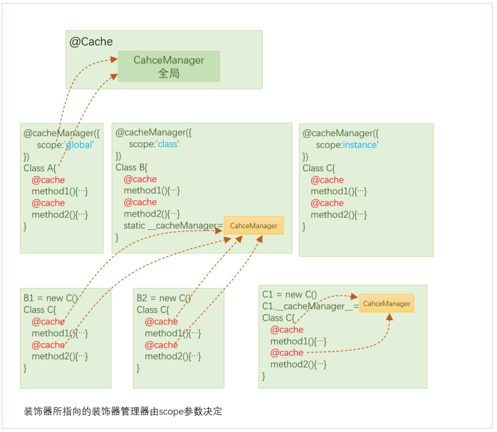

# 指南

> **注**：为了更好地理，本文中均以快速入门的例子为例来进行讲解

## 创建装饰器

`createDecorator`用来创建一个装饰器,创建装饰器的基本步骤如下：

### 声明装饰器参数

大部份的装饰器均具有若干参数，`flex-decorators`约定，所有装饰器参数均使用`{}`形式声明。
我们首先要声明一个装饰器参数，装饰器参数应该继承自`DecoratorOptions`

```typescript
import { DecoratorOptions,createDecorator  } from "flex-decorators"

export interface CacheOptions extends DecoratorOptions{
    // 此处就是装饰器的参数
}
```

### 创建装饰器

使用`createDecorator`来创建装饰器。

>**注意**：使用`createDecorator`来创建的装饰器只能被用来装饰类方法.

`createDecorator`方法函数签名如下：

```typescript
function createDecorator<T extends DecoratorOptions,METHOD=any,D=any>(
    decoratorName:string,
    defaultOptions?:T,
    opts?:createDecoratorOptions<T,METHOD>
): DecoratorCreator<T,METHOD,D>
```
**`createDecorator`方法具有三个泛型类型：**
-    `OPTIONS`: 装饰器参数
-    `METHOD`: 被装饰的函数签名
-    `DEFAULT_OPTION`: 默认装饰器参数值类型

**`createDecorator`方法具有三个参数：**

-    `decoratorName`: 装饰器名称,一般应避免冲突
-    `defaultOptions`: 默认的装饰器参数,要尽可能为所有参数提供默认值
-    `opts`: 创建装饰器控制参数

## 装饰器参数

大部份的装饰器均具有若干配置参数，`flex-decorators`规定装饰器参数类型应该继承自`DecoratorOptions`，如下：

```typescript
import { DecoratorOptions,createDecorator  } from "flex-decorators"
export interface CacheOptions extends DecoratorOptions{
    // 此处就是装饰器的参数
}
```
`DecoratorOptions`声明如下：
```typescript
export interface DecoratorOptions {
    id?: string | number;  
    enable?: boolean                            // 是否启用或关闭装饰器
}
```

- 每一个装饰器均具有一个用来标识的`id`。默认情况下，`id`值等于被装饰的方法名，也可以重载。
- `enable`参数用来控制装饰器是否生效，如果`enable=false`装饰功能无效。
- 支持指定默认的装饰器参数

```typescript
import { createDecorator  } from "flex-decorators"

export timeout = createDecorator("timeout",{
    value  : 1000,                   // 超时时间
    default: undefine
},{
    defaultOptionKey:"value"  // 指定value是默认的装饰器参数
})
// 上面指定了value是默认的装饰器参数，然后在使用装饰器时就可以只传入默认的装饰器


class MyClass{
    @timeout(1000)            // 提供默认参数
    getUsers(){...}
    @timeout()                // 使用默认参数
    getUsers(){...}
    @timeout({value:2000})    // 提供对象参数
    getUsers(){...}
}

```

## 动态读取装饰器参数

普通的装饰器配置参数一般是静态的，而在实际应用场景中，经常存在需要动态读取装饰器参数的，`flex-decorators`提供了一套从当前实例中读取装饰器参数的机制。

还是以``快速入门``中的例子，我们需要从当前类实例中读取缓存装饰器参数,主要有两种方法：

- **实现`ICacheDecoratorOptionsReader`接口**

我们在`cache.ts`中声明一个`ICacheDecoratorOptionsReader`接口，如下：

```typescript
export interface ICacheDecoratorOptionsReader {
    getCacheDecoratorOptions:((options:CacheOptions,methodName:string | symbol,decoratorName:string)=>CacheOptions) 
    | ((options:CacheOptions,methodName:string | symbol,decoratorName:string)=>Promise<CacheOptions>)
}
```

然后在目标类中实现该接口

```typescript

class App implements ICacheDecoratorOptionsReader{
    getCacheDecoratorOptions(options:CacheOptions,methodName:string | symbol,decoratorName:string):CacheOptions{
        if(methodName=='getUsers'){
            options.ttl = 100
        }else{
            options.ttl = 200
        }        
        return options
    }
    @cache()
    getUsers(){  }

    @cache()
    getDepts(){  }
}
```
当调用类的被`@cache`装饰的方法时，会调用`getCacheDecoratorOptions`方法，可以在此方法返回装饰器参数。`getCacheDecoratorOptions`方法传入`methodName`，因此就可根据不同的方法来动态提供装饰器参数
 
- **实现`IDecoratorOptionsReader`接口**

`ICacheDecoratorOptionsReader`只是针对`@cache`装饰器，而`IDecoratorOptionsReader`接口则可以适用于所有装饰器。

```typescript
class App implements IDecoratorOptionsReader{
    getDecoratorOptions(options:CacheOptions,methodName:string | symbol,decoratorName:string):CacheOptions{
        if(decoratorName=='cache'){
            if(methodName=='getUsers'){
                options.ttl = 100
            }else{
                options.ttl = 200
            }        
        }        
        return options
    }
    @cache()
    getUsers(){  }

    @cache()
    getDepts(){  }
}
```

> 如果同时实现了装饰器`ICacheDecoratorOptionsReader`和`IDecoratorOptionsReader`,则`ICacheDecoratorOptionsReader`生效。

## 装饰器重包装

装饰器最本质的功能是对原始方法进行包装返回一个新的方法，一般情况下，装饰器参数决定了包装逻辑，而包装行为是一性次的，在运行编译阶段就完成了。
在实际场景中，可能存在需要动态修改装饰器参数，此时就应该对目标方法进行重新包装，而默认的这种行为并不能满足所有场合的业务需求，为此`flex-decorators`提供了自动重新包装的能力，**当检测到装饰器参数发生变化时，会自动进行重新包装，使新的装饰器参数生效。**

- **自动重包装**

`flex-decorators`通过`autoReWrapper`来启用/停止自动重新包装，默认情况下，`autoReWrapper=true`，`flex-decorators`会在每次调用时检测装饰器参数是否已经改变，如果已经有变化，则重新包装目标函数。
`检测装饰器参数`采用浅比较方式，仅对`createDecortor`方法中的`defaultOptions`中的健值进行比较。

还是以快速入门中的例子来说明：

```typescript
interface CacheManagerOptions extends DecoratorManagerOptions{
    backend?:'file' | 'redis'       // 使用哪一种缓存后端
    size?:string,                   // 缓存区大小
    interval?:number                // 定时检查间隔
}
export cache = createDecortor("cache",{backend:"file",size:0,interval:60 * 1000})
```
上述中我们为`@cache`的`backend`,`size`,`interval`均提供了默认值，这样，当这三个参数值发生变化时，就会触发自动重包装。
现在，如果我们假设，当`size`参数发生变化时不需要触发自动重包装我，则只要不提供默认值就可以。
```typescript
export cache = createDecortor("cache",{backend:"file",interval:60 * 1000})
```

由于自动重包装需要在每次调用被装饰函数时进行装饰器参数的比较，由于一般装饰器参数一般数量不大，这种开销一般也不大，对性能影响有限，所以默认情况下，`autoReWrapper=true`。当然，您也可以通过`autoReWrapper=fale`来关闭自动重包装。

- **手动重包装**

除了自动重包装外，还支持手动重包装，需要调用`resetMethodDecorator`方法来显式地告诉`flex-decorators`，需要对某个被装饰的方法进行重新包装。

```typescript
import { resetMethodDecorator } from "flex-decorators"

class MyClass{
    constructor(){
        resetMethodDecorator(this,"cache","method1")
    }
    @cache()
    method1(){...}
}

```
`resetMethodDecorator`方法原理很简单，就是将传入的要重置的装饰器信息保存到当前实例的`__DIRTY_METHOD_DECORATORS`中，然后在执行该方法时如果发现该信息，则进行重新包装。所以`resetMethodDecorator`方法执行后并不是马上进行重新包装的，而是在执行时才会进行重新包装的。

## 装饰器生效

任何装饰器均可以通过传入`enable`参数来使装饰功能失效。
```typescript
class MyClass{
    @cache({enable:false})    
    getData(){...}
}
```
当`enable=false`时，就会执行原始的方法，装饰功能失效。
结合动态读取装饰器参数的功能，我们就可以很灵活地决定启用/停止某个方法的装饰功能。
```typescript
class MyClass{
    #cacheable:boolean = true
    getCacheDecortorOptions(options:CacheOptions,methodName:string | symbol,decoratorName:string){
        if(decoratorName=='cache' && methodName=='getData'){
            options.enable = this.#cacheable
        }
        return options
    }
    @cache()    
    getData(){...}    
    enableCache(){
        this.#cacheable = true
    }
    disableCache(){
        this.#cacheable = false
    }
}

let myInstance = new MyClass()

myInstance.enableCache()        // 使getData的缓存生效
myInstance.disableCache()       // 使getData的缓存失效
```

## 装饰器ID

每一个被装饰的方法均具有一个`id`参数，该值默认等于被装饰的方法名称，但是也可以重载覆盖。

```typescript
class MyClass{ 
    @cache()     //  == @cache({id:'getDate'})
    getData(){...}     
    @cache({id:"users"})  // 自定义id
    getUsers(){...} 
}
```

## 装饰器异步包装问题
 
装饰器最本质的功能是对原始方法进行包装返回一个新的方法，一般情况下，装饰器即可以被用来装饰同步函数，也可以用来装饰同步函数。
理想情况下，应该尽可能保持被装饰方法的函数类型，当被装饰方法是同步方法时，包装后的方法应该是同步方法，当被装饰方法是异步方法时，包装后的方法也应该是异步方法.
但是受限于装饰器本身要实现的功能以及`async/await`函数的传染性问题的约束， 装饰器可能会采取不同的包装策略。

- 在快速入门例中，`cacheManager`的`get/set`方法均是异步方法，这就决定了被`@cache`装饰的方法只能包装为`async`函数才可以正确工作。这是由装饰器本身要实现的功能决定的。
- 有些情况下，通过`ICacheDecoratorOptionsReader`和`IDecoratorOptionsReader`这两个接口方法动态读取装饰器参数时，需要这两个接口是异步布方法（比如从数据库/HTTP中读取）。由于`async/await`函数的传染性问题,这就要求被装饰的方法也必须包装为异步方法才能正常工作。

为了解决以上问题，`flex-decorators`通过`asyncWrapper`参数来控制装饰器函数的包装策略。

`asyncWrapper`参数取值：`true | false | 'auto'(默认)`

- 当`asyncWrapper='auto'`时，`flex-decorators`会根据被包装方法和`ICacheDecoratorOptionsReader`和`IDecoratorOptionsReader`这两个接口方法来自动决定包装为同步或者异步方法。只要其中有一个方法是异步方法，`flex-decorators`就会将被包装方法包装为异步方法。
- 但是`asyncWrapper='auto'`并不总是能正确工作，比如在`快速入门`的例子中，如果`getData`和`getCacheDecoratorOptions`均是同步方法，则按照`asyncWrapper='auto'`策略，`getData`方法将被包装为同步方法，但是明显`Cache`操作是个异步行为，这不能符合预期，因此需要通过`asyncWrapper=true`明确告诉装饰器需要将被装饰的方法包装为异步方法。

> 因此，当装饰器功能涉及到异步操作时，一般应该配置`asyncWrapper=true`.


## 装饰器管理器

### 概念

装饰器的功能是对原始方法进行包装并返回一个新的方法,其本质是在函数执行前或执行后注入一些应用逻辑，一般情况下，如果这些逻辑比较简单，可以直接在闭包环境和包装函数中写逻辑代码，如下：
```typescript
export const memorize = createDecorator("memorize",{},{
    wrapper: function(method:Function,options:RetryOptions):Function{
        let results 
        return function(this:any,...args:any[]){
            if(results===undefined){
                results=method.apply(this,arguments)
            }
            return results
        }
    }
})
```
以上`memorize`装饰器逻辑比较简单，所以将执行的结果直接保存在闭包上下文中即可。
但是并不是所有所有装饰器的功能逻辑均这么简单，例如`快速入门`的例子中的缓存控制逻辑就比较复杂，此情况下，一般不推荐在包装函数中直接编写装饰器的功能逻辑，而应该将装饰器的功能逻辑分离出来。
> **最佳实践**：装饰器的功能逻辑与包装逻辑分离

基于以上考虑，`flex-decorators`引入了装饰器管理器`DecoratorManager`的概念，我们推荐开发者在开发具备一定复杂度的装饰器时，采用`DecoratorManager`机制来实现装饰器的功能逻辑.


### 创建装饰器管理器

自定义的装饰器管理器应该继承自`DecoratorManager`

```typescript
import { DecoratorManager, DecoratorManagerOptions  } from "flex-decorators"

interface CusotmManagerOptions extends DecoratorManagerOptions{
    // 此处是管理器配置参数
} 
class CustomDecoratorManager extends DecoratorManager{
    constructor(decoratorName:string, options:CusotmManagerOptions){
        //
    }
    async onStart(){
        // 此处启动逻辑
    }
    async onStop(){
        // 此处停止清理逻辑
    }    
}
``` 

接下来需要在创建装饰器时传入`manager`参数，用来告诉装饰器应该使用哪一个装饰器管理器。

```typescript
import { createDecorator  } from "flex-decorators"

export myDecorator= createDecorator("myDecorator",{
   // 装饰器默认参数
},{
    wrapper: function(method:Function,options:CacheOptions,manager?:IDecoratorManager){
        //...
    },
    // 1.提供管理器类，会根据initial参数自动实例化
    manager:CustomDecoratorManager                  
    // 2.提供管理器实例类
    manager:new CustomDecoratorManager()            
    // 3.返回管理器类或实例的函数
    manager:() =>CustomDecoratorManager || new CustomDecoratorManager()            
    // 4. 完整参数
    manager:{
        // 是否启动装饰器管理器，当第一次调用时会实例化管理器，如果=false，则管理器需要由开发者自行初始化并启动
        autoStart?:boolean          
        // 决定什么时候实例化管理器,once=立刻实例化, demand=按需实例化, 
        initial?:'demand' | 'once' | 'manual'
        // 管理器类 / 管理器实例 / 返回
        creator?:IDecoratorManager| (ImplementOf<IDecoratorManager>)  | (typeof DecoratorManager) | WithReturnFunction<IDecoratorManager|typeof DecoratorManager| (ImplementOf<IDecoratorManager>) >           
        // 传递给管理器实例的默认构造参数
        defaultOptions?:Record<string,any>   
    }
})
```

**`manager`参数类型为`DecoratorManagerCreateOptions`，声明如下：**

```typescript
export type DecoratorManagerCreateOptions = DecoratorManagerCreateFinalOptions | IDecoratorManager| (ImplementOf<IDecoratorManager>)  | (typeof DecoratorManager) | WithReturnFunction<IDecoratorManager|typeof DecoratorManager| (ImplementOf<IDecoratorManager>)> | undefined

export type DecoratorManagerCreateFinalOptions = {
    // 是否启动装饰器管理器，当第一次调用时会实例化管理器，如果=false，则管理器需要由开发者自行初始化并启动
    autoStart?:boolean          
    // 决定什么时候实例化管理器,once=立刻实例化, demand=按需实例化, 
    initial?:'demand' | 'once' | 'manual'
    // 管理器类 / 管理器实例 / 返回
    creator?:IDecoratorManager| (ImplementOf<IDecoratorManager>)  | (typeof DecoratorManager) | WithReturnFunction<IDecoratorManager|typeof DecoratorManager| (ImplementOf<IDecoratorManager>) >          
    // 传递给管理器实例的默认构造参数
    defaultOptions?:Record<string,any>              
}
````

**说明:**

- `initial`默认值是`demand`，即按需自动实例化管理器，当首次调用被对应装饰器装饰的方法时自动实例化装饰器，如果`autoStart=true`,则同时自动启动该管理器。
- `manager`参数可以简化为提供一个`DecoratorManager`类或实例，或者一个实现了`IDecoratorManager`的类或实例，或者一个返回`DecoratorManager`类或实例的函数。
- 可以为`manager`参数提供一个默认参数`defaultOptions`，用在实例化管理器传入。

### 实例化装饰器管理器

当调用`createDecorator`传入的`manager`或`manager.creator`是一个`DecoratorManager`类实例，就代表了装饰器管理器实例是由开发创建的，`flex-decorators`就不会负责进行实例化。
而当传入的`manager`或`manager.creator`是一个`DecoratorManager`类时，`flex-decorators`就会在合适的时机实例化`DecoratorManager`，这主要是由`manager.initial`参数决定的.

- `manager.initial='once'`时，当创建装饰器就马上实例化创建一个`DecoratorManager`实例
- `manager.initial='demand'`时，启用按需延迟实例化机制，不会马上实例化创建一个`DecoratorManager`实例，而是在对应的装饰器装饰的函数第一次调用时进行实例化。以快速入门中的例子说明，当被`@cahce`装饰的函数第一次执行时才创建一个`CacheManager`实例并且启动。也就是说，如果被`@cahce`装饰的函数均没有得到执行，则不会创建`CacheManager`实例

### 启动与停止装饰器管理器

上述说明装饰器管理器负责实现装饰器的功能逻辑，一般而言，需要一个初始化过程和清理过程，因此`flex-decorators`为管理提供了一个启动与停止的方法,并在实例化管理器时自动调用。

- 一般在启动时进行初始化工作，比如在缓存管理器中可以连接到redis等。
- 在停止管理器时进行相应的清理工作，比如在缓存管理器中可能需要断开redis连接等。
- 默认`autoStart=true`，即实例化管理时会自动启动，如果`autoStart=false`，则应用开发者需要自行控制启动。如`快速入门`中的例子，需要调用`await cache.getManager().start()`，或者在类中使用`await (this as any).cacheManager.start()`。
- 停止管理器需要开发自行调用`await cache.getManager().stop()`

**装饰器管理器类声明如下：**

```typescript
export class DecoratorManager{      
    get options():DecoratorManagerOptions
    get enable():boolean
    set enable(value:boolean)
    get decoratorName():string
    get status():DecoratorManagerStatus
    get running(): boolean
    get defaultDecoratorOptions():Record<string,any>    
    async start(timeout?:number)
    async onStart()
    async stop(timeout?:number) 
    async onStop()
    register(instance:DecoratorManager)
    getMethods(instance?:object):DecoratorList | DecoratedMethodList
} 
```

### 装饰器管理器作用域

#### 全局作用域

默认情况下，所有装饰器均共享一个对应的装饰器管理器，比如`@cache`装饰器被应用到所有的类中，且这些装饰器均共享同一个装饰器管理器，这种情况是比较普通的应用场景。


`flex-decorators`支持通过创建的管理器装饰器来创建多个管理器实例和注入访问管理器的成员变量,例如快速入门中的`@cacheManager`装饰器。

是否创建`管理器装饰器`取决于您的装饰器本身的功能需要。`管理器装饰器`主要具备两个功能：
- 为类实例注入一个访问所作域内管理器实例的成员内部类变量，名称为`<装饰器名称>Manager`，例中快速入门中的`cacheManager`。当在类上使用`@cacheManager()`时，该类实例中就会注入一个名称为`cacheManager`的属性.
- 根据`@cacheManager({scope='global | class | instance'})`传入的scope参数来决定在类或实例上创建一个管理器实例，名称为`__<装饰器名称>Manager__`。

#### 创建管理器装饰器

**创建`管理器装饰器`方法如下：**

每一个创建的装饰器均具有一个`createManagerDecorator`方法用来创建一个对应的`管理器装饰器`。

`createManagerDecorator`方法签名如下：
```typescript
function createManagerDecorator<MANAGER extends ImplementOf<IDecoratorManager>,OPTIONS extends DecoratorManagerOptions>(managerClass :ImplementOf<IDecoratorManager>,  defaultOptions?:OPTIONS):ManagerDecoratorCreator<MANAGER,OPTIONS>
```

示例如下：

```typescript
export cache = createDecorator(...)
export cacheManager = cache.createManagerDecorator<CacheManager,cacheManagerOptions>(CacheManager,{
    // 传递给装饰器管理器的参数
})

// 
export myDecorator = createDecorator(...)
export myDecoratorManager = myDecorator.createManagerDecorator<myDecoratorManager,myDecoratorManagerOptions>(myDecoratorManager,{
    // 传递给装饰器管理器的参数
})

```

#### 局部作用域

当装饰器创建了对应的`管理器装饰器`后，就可以使用该`管理器装饰器`来为类声明装饰创建一个作用域范畴，使得作用域范围内的装饰器均使用其创建的管理器实例。





- 如果类没有使用`管理器装饰器`(例如`@cacheManager`)装饰，或者`管理器装饰器`的`scope='global'`，则该类内的所有装饰器均使用全局的装饰器管理器。此时使用`@cacheManager({scope:'global'})`唯一功能是为该类注入一个`cacheManager`的成员属性指向全局的`CacheManager`。
- 如果类使用`管理器装饰器`装饰器，且`scope='class'`，则会在该类上创建一个管理器实例，并且该类上的对应的装饰器均指向该管理器实例。例如，上图中，`B1.cacheManager == B2.cacheManager == B.__cacheManager__`。
- 如果类使用`管理器装饰器`装饰器，且`scope='instalce'`，则每一个类实例均会创建管理器实例，并且该实例上的对应的装饰器均指向该管理器实例。例如，上图中，`C1.cacheManager == C1.__cacheManager__`。
- 当使用`@cacheManager({scope:'class | instance'})`时会自动创建一个管理器实例，可以在`管理器装饰器`传入管理器的构建参数。

```typescript

@cacheManager({
    scope:'class',
    backend:"redis"
    // ...其他CacheManagerOptions
})
class MyClass1{

}
@cacheManager({
    scope:'class',
    backend:"file",
    // ...其他CacheManagerOptions
})
class MyClass2{

}

```

以`快速入门`中的例子，上面的`MyClass1`和`MyClass2`这两个类分别创建了两个`CacheManager`实例，并且其参数可以是不一样的，实际上`@cacheManager({...})`传入的参数会被传递给管理器类。

### 实现管理器接口

一般情况下建议装饰器管理器继承自`DecoratorManager`，但是由于`JavaScript/TypeScript`不支持多继承，这样在某此情况下就比较麻烦。为此，`flex-decorators`也支持管理器只实现`IDecoratorManager`即可。

```typescript

export interface IDecoratorManager{
    get running(): boolean      // 是否正在运行中
    get enable(): boolean       // 是否启用装饰器功能
    get decoratorName():string  // 装饰器名称
    get status():DecoratorManagerStatus     // 管理器的状态
    get defaultDecoratorOptions():Record<string,any>    // 默认的装饰器参数
    start(timeout?:number):Awaited<Promise<any>>        // 启动装饰器管理器
    stop(timeout?:number):Awaited<Promise<any>>         // 停止装饰器管理器
    register(instance:IDecoratorManager):void           // 将被装饰的实例注册到管理器
}

import { IDecoratorManager } from "flex-decorators"
class MyDecoratorManager implements IDecoratorManager{
    //..
}
```

- 如果选择实现`IDecoratorManager`接口，则开发者应该自行控制管理器的状态。

### 开发装饰器管理器

装饰器管理器负责装饰器的主要功能逻辑，要开发一个符合`flex-decorators`的装饰器管理器有两种方式：

- 类继承自`DecoratorManager`
- 类实现`IDecoratorManager`接口

### HOOK

`管理器装饰器`支持`IDecoratorManagerHook`接口，可以在执行被装饰方法前后调用，这样装饰器管理器就可以进行一些功能扩展。

**`IDecoratorManagerHook`接口声明如下：**

```typescript

export class CacheManager extends IDecoratorManager{
    onBeforeCall(instance:object,args:any[],methodContext:DecoratorMethodContext,decoratorContext:DecoratorContext):void
    onAfterCall(instance:object,returns:any,methodContext:DecoratorMethodContext,decoratorContext:DecoratorContext):void
}
```

- 当执行被装饰的方法前调用`onBeforeCall`，其中`args`是传入的参数,可以在此修改参数等操作。
- 当被装饰的方法执行后调用`onAfterCall`，`returns`值是执行结果。
- `methodContext`和`DecoratorContext`可以读取到一些上下文信息，如下：

```typescript
export type DecoratorMethodContext = {
    options?:Record<string,any>         // 装饰器参数
    class:Object                        // 被装饰的目标类
    methodDescriptor:any                //
    methodName:string                   // 被装饰的方法名称
    asyncOptionsReader:boolean          //get<decoratorName>DecoratorOptions和getDecoratorOptions是否是异步方法
    optionsReader?:Object | Function    
    [key:string]:any
}
export type DecoratorContext = {
    defaultOptions:Record<string,any>           // 装饰器默认参数
    createOptions:Record<string,any>            // 创建装饰器的参数
    decoratorName:string      
    manager?:IDecoratorManager                   // 全局管理器实例
    [key:string]:any
}
```
## 遍历类被装饰方法

使用`getDecorators`方法可以读取到当前类中所有被装饰的方法。

`getDecorators`方法签名如下：

```typescript
function getDecorators(instance: any,decoratorName?:string,options?:{cache?:boolean}):DecoratorList | DecoratedMethodList 
```
- `instance`: 类实例
- `decoratorName`：装饰器名称
- `cache`：是否使用缓存，默认值`true`。

```typescript
import { getDecorators } from 'flex-decorators'

class MyClass1{
    @cache()
    method1(){}
    @cache()
    method1(){}
    @timeout()
    method3{}
    @timeout()
    method3{}
}

getDecorators(new MyClass1(),"cache") // == {method1:{装饰器参数},method2:{装饰器参数}}
getDecorators(new MyClass1(),"timeout") // == {method3:{装饰器参数},method3:{装饰器参数}}

getDecorators(new MyClass1()) 
// == {
//      cache:{method1:{装饰器参数},method2:{装饰器参数}},
//      timeout:{method3:{装饰器参数},method3:{装饰器参数}}
// }
```

装饰器管理器也有一个`getMethods`方法用来返回所有被装饰的方法信息。

```typescript
let manager:CacheManager = cache.getManager()
manager.getMethods(new MyClass1())        //== getDecorators(new MyClass1(),"cache") 
```
